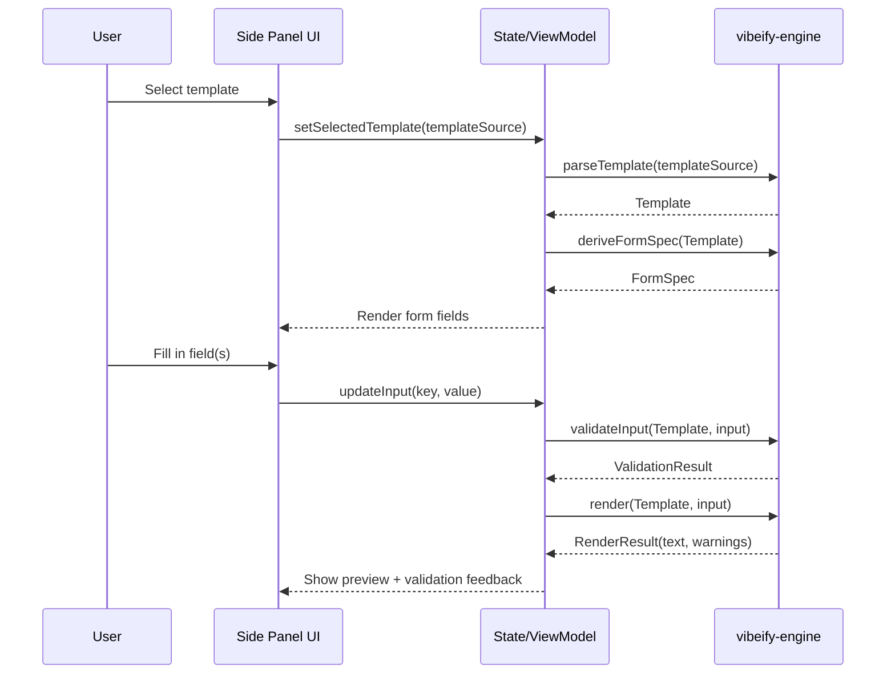
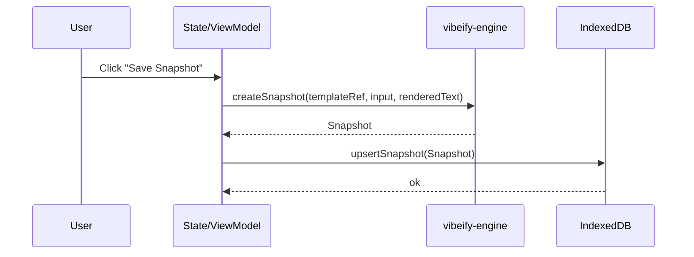
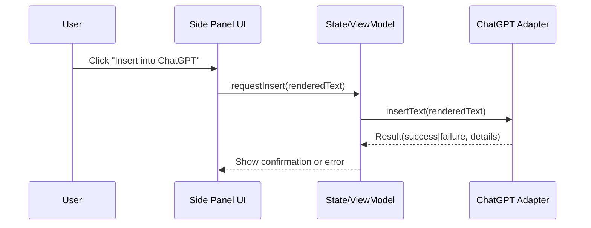

# Vibeify Forge — Architecture Brief (v0.1)

## 1. Purpose

Vibeify Forge is a browser extension that lets users design, preview, and reuse structured prompts directly alongside ChatGPT. The system must feel lightweight and trustworthy: **offline-first, deterministic, and workflow-adjacent** (it supports what users already do rather than replacing it). 

This brief defines the **technical shape** of the MVP: codebase structure, core components, boundaries, and the shared library strategy.

---

## 2. Core Architectural Principles

### 2.1 Determinism over magic

Given the same template + inputs, the system must always render the same prompt text. No silent AI transformations.

### 2.2 Offline-first by default

The MVP must function without accounts or servers. Trust comes from local control.

### 2.3 Strict separation of concerns

The “prompt engine” must be reusable outside the browser extension. The extension is an adapter shell around it.

### 2.4 Small surfaces, stable contracts

Prefer a minimal engine API that is hard to misuse. UI and integration complexity must not leak inward.

---

## 3. System Decomposition

The MVP is intentionally split into two major packages:

1. **Shared Engine (`vibeify-engine`)**

   * Pure prompt logic: parsing template metadata, validating inputs, rendering deterministic output.
2. **Browser Extension (`vibeify-forge-extension`)**

   * UI, persistence, and ChatGPT page integration.

Directional dependency:

```
extension  →  engine
(engine must not depend on extension or browser APIs)
```

---

## 4. Repository & Project Organisation

### 4.1 Monorepo workspace (MVP)

A single repo is used to keep refactors atomic and keep the engine and extension evolving in lockstep during MVP.

Recommended layout:

```
vibeify-forge/
├─ packages/
│  ├─ engine/
│  └─ extension/
├─ docs/
├─ tooling/
└─ package.json
```

Rationale:

* One PR can change engine + extension safely.
* Shared lint/TS config is trivial.
* Clear ownership boundaries still exist via package separation.

### 4.2 Package responsibilities

#### `packages/engine` — MUST

* Contain only platform-agnostic TypeScript
* Export deterministic APIs
* Include full unit test coverage for core logic

#### `packages/extension` — MUST

* Contain all browser + DOM interaction
* Persist data in IndexedDB/local storage
* Use the engine as a dependency (no re-implementations)

---

## 5. The Shared Engine (`vibeify-engine`)

### 5.1 Engine responsibilities (in scope)

The engine is a **pure library** that provides:

* Template model + placeholder metadata
* Input validation (type-level and runtime)
* Deterministic rendering (template + inputs → prompt text)
* Structured error objects (for UI display)
* Serialization helpers (import/export snapshots)

### 5.2 Engine responsibilities (explicitly out of scope)

The engine MUST NOT:

* Access DOM, WebExtension APIs, or browser storage
* Call ChatGPT, OpenAI, or any network APIs
* Contain UI state, React hooks, or form logic
* Make policy decisions about what is “good” output

### 5.3 Engine public API (MVP shape)

The engine should expose a small set of functions (names illustrative):

* `parseTemplate(source) -> Template`
* `deriveFormSpec(template) -> FormSpec`
* `validateInput(template, input) -> ValidationResult`
* `render(template, input) -> RenderResult { text, warnings }`
* `createSnapshot(templateId, input, renderedText) -> Snapshot`

The key point: **the extension never “builds prompts” itself** — it orchestrates these calls.

---

## 6. Extension Architecture (`vibeify-forge-extension`)

### 6.1 Responsibilities

The extension is an adapter shell responsible for:

* Side-panel UI (template selection, form input, preview)
* Local library storage (templates + snapshots)
* ChatGPT interaction:

  * copy rendered prompt
  * insert rendered prompt into active input box

### 6.2 Integration boundary (“ChatGPT adapter”)

All DOM selectors and injection logic must be isolated behind an adapter layer, so breakage from ChatGPT UI changes is contained.

Example conceptual module:

* `chatgptAdapter.insertText(text): Result`
* `chatgptAdapter.isSupportedPage(): boolean`

---

## 7. Data Model (MVP)

### 7.1 Entities

* **Template**

  * id, name, version (optional), placeholder definitions, raw source
* **Snapshot**

  * templateId, input values, rendered text, timestamps, optional tags
* **Library**

  * collection metadata, user labels/folders (optional MVP)

### 7.2 Storage

MVP uses **IndexedDB** (preferred) or browser storage abstraction, with explicit schema versioning to prevent data loss.

---

## 8. Quality & Testing Strategy

### 8.1 Engine tests (high value)

* Unit tests for rendering determinism
* Validation tests for placeholder typing
* Golden-file tests for render output

### 8.2 Extension tests (targeted)

* Minimal automated tests for storage adapters
* Manual QA checklist for ChatGPT insertion (because DOM changes)

---

## 9. Key Risks and Architectural Mitigations

| Risk                                     | Architectural mitigation                                   |
| ---------------------------------------- | ---------------------------------------------------------- |
| ChatGPT UI changes break insertion       | Adapter module + fail-soft behaviour                       |
| Engine becomes entangled with UI         | Hard dependency rule + CI checks                           |
| Feature creep turns this into a platform | Strict MVP boundary: no accounts, no cloud, no marketplace |
| Storage migrations break data            | Schema versioning + migration function from day one        |

---

## 10. MVP Exit Criteria (Architecture-Level)

The architecture is “MVP-complete” when:

* Engine is **pure and reusable**
* Extension uses engine for all rendering/validation
* Data persists locally and survives reloads
* Rendered prompts are deterministic and preview matches inserted text
* ChatGPT integration is isolated and failure-tolerant

---

## 11. Component Diagram and Data Flow

### 11.1 Logical components

```mermaid
flowchart LR
  subgraph EXT[Browser Extension]
    UI[Side Panel UI<br/>(React)]
    STATE[State / ViewModel<br/>(inputs, selection)]
    STORE[Local Library Storage<br/>(IndexedDB)]
    ADAPT[ChatGPT Adapter<br/>(DOM integration)]
  end

  subgraph ENG[Shared Library: vibeify-engine]
    TPL[Template Model + Parser]
    FORM[FormSpec Deriver]
    VAL[Input Validator]
    REND[Deterministic Renderer]
    SNAP[Snapshot Builder]
  end

  UI <--> STATE
  STATE <--> STORE
  STATE --> TPL
  STATE --> FORM
  STATE --> VAL
  STATE --> REND
  STATE --> SNAP
  UI --> ADAPT

  TPL --> FORM
  TPL --> VAL
  TPL --> REND
  REND --> SNAP
```

**Architectural boundary rule:** Everything inside **ENG** is platform-agnostic. Everything browser/DOM/storage lives inside **EXT**.

---

### 11.2 Core user flows (MVP)

#### Flow A — Design → Preview (happy path)



**Invariant:** Preview text == the text that will be inserted/copied. No hidden transformations.

---

#### Flow B — Save Snapshot (rendered prompt + inputs)



Snapshots are *portable artefacts*: they can be exported later without needing the extension.

---

#### Flow C — Insert into ChatGPT



**Failure-soft requirement:** If insertion fails (DOM changed), “Copy” still works and user can paste manually.

---

### 11.3 Data flow contracts (what crosses boundaries)

Only these things should cross the extension → engine boundary:

* `templateSource` (string or structured template JSON)
* `input` (plain object)
* `Template`, `FormSpec`, `ValidationResult`, `RenderResult`, `Snapshot` (engine types)

Nothing else. No DOM. No storage handles. No UI state objects.

---

## 12. Engine API Contract v0.1

This section defines the **public contract** for `vibeify-engine` (TypeScript). It is intentionally small, boring, and testable.

### 12.1 Goals of the engine API

* deterministic: same inputs → same outputs
* explicit: no implicit defaults unless the caller provides them
* UI-friendly: structured errors and field-level validation
* portable: no browser/runtime dependencies

---

### 12.2 Core types

```ts
// packages/engine/src/types.ts

export type PlaceholderType =
  | "string"
  | "text"
  | "number"
  | "boolean"
  | "enum"
  | "string[]";

export type Severity = "info" | "warning" | "error";

/**
 * Minimal placeholder metadata needed to:
 *  - generate a form
 *  - validate inputs
 *  - render deterministically
 */
export interface PlaceholderDef {
  key: string;                    // SCREAMING_SNAKE_CASE
  type: PlaceholderType;
  required: boolean;

  // For enum only
  enumValues?: string[];

  // For UI hints (optional)
  title?: string;
  description?: string;
  example?: string;

  // Rendering behaviour (optional)
  multiline?: boolean;            // affects UI; rendering stays deterministic
}

export interface TemplateMeta {
  id?: string;                    // stable identifier if known
  name?: string;                  // human friendly
  version?: string;               // optional
  description?: string;
}

export interface Template {
  meta: TemplateMeta;
  placeholders: Record<string, PlaceholderDef>;
  /**
   * Renderable body. For MVP keep this as a single string with {{KEY}} tokens,
   * or a structured representation if you already have it.
   */
  body: string;

  /**
   * Optional: pre-split sections if you want better UX later.
   * Not required for MVP.
   */
  sections?: Array<{ id: string; title?: string; body: string }>;
}
```

---

### 12.3 Form specification (engine → UI)

The UI should not need to infer how to build inputs. The engine emits a form spec.

```ts
export interface FormField {
  key: string;
  label: string;
  type: "text" | "textarea" | "number" | "checkbox" | "select" | "chips";
  required: boolean;

  description?: string;
  placeholder?: string;
  options?: Array<{ value: string; label: string }>; // for select
}

export interface FormSpec {
  templateId?: string;
  fields: FormField[];
  /**
   * Optional: group fields for UX.
   */
  groups?: Array<{ id: string; title: string; fieldKeys: string[] }>;
}
```

Mapping rules (v0.1):

* `string` → `text`
* `text` → `textarea`
* `number` → `number`
* `boolean` → `checkbox`
* `enum` → `select`
* `string[]` → `chips` (or multiline textarea, but chips is nicer)

---

### 12.4 Validation model

Validation must be field-level and machine-usable.

```ts
export interface FieldIssue {
  key: string;                 // placeholder key
  severity: Severity;          // usually "error" for invalid
  message: string;             // UI-friendly
  code: string;                // stable identifier, e.g. "REQUIRED_MISSING"
}

export interface ValidationResult {
  ok: boolean;
  issues: FieldIssue[];
}
```

---

### 12.5 Rendering model

Rendering must return text + structured diagnostics.

```ts
export interface RenderWarning {
  severity: "warning" | "info";
  message: string;
  code: string;                // e.g. "UNUSED_INPUT", "EMPTY_OPTIONAL"
}

export interface RenderResult {
  text: string;                // final prompt text
  warnings: RenderWarning[];
}
```

---

### 12.6 Snapshot model

Snapshots are the shareable “unit of reuse”.

```ts
export interface Snapshot {
  id: string;                  // uuid
  templateRef?: string;         // engine doesn't resolve storage paths; extension may set
  templateId?: string;
  templateVersion?: string;

  input: Record<string, unknown>;
  renderedText: string;

  createdAt: string;           // ISO date-time
  updatedAt?: string;          // ISO date-time

  // Optional UX metadata (extension may add)
  title?: string;
  tags?: string[];
}
```

---

### 12.7 Public functions

This is the **minimal** public surface for MVP.

```ts
// packages/engine/src/index.ts

import {
  Template,
  FormSpec,
  ValidationResult,
  RenderResult,
  Snapshot,
} from "./types";

export interface ParseOptions {
  /**
   * Strict parsing rejects unknown fields, invalid placeholder keys, etc.
   * In MVP, default to strict=true.
   */
  strict?: boolean;
}

export function parseTemplate(source: string, opts?: ParseOptions): Template;

/**
 * Derive a UI-ready form spec from a template.
 */
export function deriveFormSpec(template: Template): FormSpec;

/**
 * Validate an input object against a template's placeholder definitions.
 * No defaults are injected here. Caller must merge defaults if desired.
 */
export function validateInput(
  template: Template,
  input: Record<string, unknown>
): ValidationResult;

/**
 * Deterministically render a prompt.
 * MUST NOT mutate input, template, or rely on any runtime state.
 */
export function render(
  template: Template,
  input: Record<string, unknown>
): RenderResult;

/**
 * Create a portable snapshot object.
 */
export function createSnapshot(args: {
  template?: Template;
  templateId?: string;
  templateVersion?: string;
  templateRef?: string; // optional string provided by caller
  input: Record<string, unknown>;
  renderedText: string;
  title?: string;
  tags?: string[];
  now?: Date;           // injectable for determinism in tests
}): Snapshot;
```

---

### 12.8 Determinism requirements (testable)

The following requirements MUST hold for the engine:

1. `render(template, input)` is a pure function:

   * no global reads (time, random, env)
   * no IO
   * no mutation of arguments
2. `parseTemplate(source)` is deterministic:

   * same source → structurally equal Template
3. Validation is stable:

   * same template + input → same issues (order stable)

Practical test approach:

* golden tests for `render`
* table-driven tests for `validateInput`
* parser fixture tests for `parseTemplate`

---

### 12.9 Extension responsibilities (explicit, to avoid “engine creep”)

The extension MUST own:

* defaults merging (if any)
* persistence (IndexedDB)
* template IDs and naming conventions
* import/export UX
* ChatGPT DOM integration

The engine MUST own:

* template parsing rules
* placeholder typing/validation rules
* deterministic rendering

---

## 13. Storage Schema and Migration Plan (IndexedDB)

This section defines the **local persistence model** for Vibeify Forge MVP, including schema versioning and deterministic migrations. It is designed to be:

* **offline-first**
* **migration-safe**
* **audit-friendly** (no silent data loss)
* **simple enough for MVP**

It assumes IndexedDB as the primary store (with a thin wrapper), per the MVP proposal’s local-library requirement. 

---

### 13.1 Storage goals

**MUST**

1. Persist templates, snapshots, and lightweight user organisation metadata locally.
2. Support schema evolution without data loss.
3. Allow export/import without requiring internal DB details.
4. Keep engine artefacts portable (snapshots and templates survive outside the extension).

**MUST NOT**

1. Require an account, server, or cloud sync (MVP).
2. Store secrets (API keys) in MVP storage.
3. Couple storage shape to UI state (no “React state dumps”).

---

### 13.2 Database choice

**Primary:** IndexedDB
Rationale:

* Handles structured data and indexes well.
* Larger capacity than `chrome.storage.local`.
* Supports migrations via versioned upgrades.

**Implementation note (non-normative):**
Use a small wrapper library *or* a minimal internal adapter, but keep an escape hatch to raw IndexedDB if needed.

---

### 13.3 Database identity

**DB name:** `vibeify_forge`
**Schema version:** integer, starting at `1`

Store a separately readable “app schema version” inside metadata as well, so that export files can carry it too.

---

### 13.4 Object stores (Schema v1)

#### 13.4.1 `templates` store

**Purpose:** user’s local template library

**Key path:** `id` (string, UUID or stable derived id)

**Record shape (v1):**

```ts
interface StoredTemplateV1 {
  id: string;                 // primary key
  name: string;               // user-visible name
  description?: string;

  // raw template source (e.g. YAML or markdown-with-metadata)
  source: string;

  // optional extracted meta for listing/filtering (not authoritative)
  engineMeta?: {
    templateId?: string;
    version?: string;
  };

  createdAt: string;          // ISO
  updatedAt: string;          // ISO

  // user-level organisation
  tags?: string[];
  pinned?: boolean;
}
```

**Indexes:**

* `name` (non-unique)
* `updatedAt` (non-unique)
* `pinned` (non-unique)
* `tags` (multiEntry if supported by wrapper; otherwise maintain separate tag map)

---

#### 13.4.2 `snapshots` store

**Purpose:** saved “prompt instances” (inputs + rendered output)

**Key path:** `id`

**Record shape (v1):**

```ts
interface StoredSnapshotV1 {
  id: string;                 // primary key (uuid)
  title?: string;

  templateRef?: string;       // usually templates.id
  templateId?: string;        // from engine meta if available
  templateVersion?: string;

  input: Record<string, unknown>;
  renderedText: string;

  createdAt: string;          // ISO
  updatedAt?: string;         // ISO

  tags?: string[];
  starred?: boolean;
}
```

**Indexes:**

* `templateRef` (non-unique)
* `createdAt` (non-unique)
* `starred` (non-unique)
* `tags` (multiEntry if feasible)

---

#### 13.4.3 `settings` store

**Purpose:** minimal extension settings + schema markers

**Key path:** `key`

**Record shape (v1):**

```ts
interface StoredSettingV1 {
  key: string;
  value: unknown;
  updatedAt: string;          // ISO
}
```

**Required keys (v1):**

* `schemaVersion` (number) — mirrors IDB version for sanity checks
* `installId` (string) — random UUID for diagnostics (not identity)
* `lastBackupAt` (string | null) — if you add export reminders later

Indexes not required.

---

### 13.5 Data invariants (MVP)

These invariants keep storage sane and migrations predictable.

1. **Templates are immutable artefacts with mutable metadata**

   * You may rename a template without rewriting its `source`.
2. **Snapshots are append-mostly**

   * Editing a snapshot should create a new snapshot *unless explicitly “overwrite”* is chosen.
3. **Rendered text is stored**

   * Even if template parsing breaks later, a snapshot remains usable.
4. **No cross-store cascading deletes in MVP**

   * Deleting a template does not delete snapshots automatically; instead snapshots become “orphaned” and UI can warn.

---

### 13.6 Export format (MVP)

Exports should be **engine-portable** and **forward-compatible**.

**Export file shape:**

```json
{
  "format": "vibeify-forge-export",
  "formatVersion": 1,
  "exportedAt": "2026-01-09T12:00:00.000Z",
  "schemaVersion": 1,
  "templates": [ ... ],
  "snapshots": [ ... ],
  "settings": {
    "userPreferences": { ... }
  }
}
```

Rules:

* Export includes `source` for templates and `renderedText` for snapshots.
* Export omits ephemeral UI state.
* Export is validated on import with clear errors (don’t half-import silently).

---

## 13.7 Migration plan

### 13.7.1 Migration principles

**MUST**

1. Migrations are deterministic and idempotent.
2. Every schema bump has a matching migration function.
3. Migrations never delete user data silently.
4. If migration fails, the extension must enter a safe mode that allows export of raw data.

**MUST NOT**

1. “Best effort” partial migrations without reporting.
2. Auto-reset the DB on failure.

---

### 13.7.2 Versioning strategy

* IndexedDB version is the source of truth (`db.version`).
* Application-level schema version is stored in `settings.schemaVersion` as a cross-check.

**On startup:**

1. Open DB with current code’s expected version `N`.
2. If upgrade needed, run `onupgradeneeded`.
3. After success, set `settings.schemaVersion = N`.
4. If mismatch detected later (rare), surface a recovery UI.

---

### 13.7.3 Migration execution model

Use a single upgrade function that applies incremental migrations:

```ts
type Migration = (db: IDBDatabase, tx: IDBTransaction) => void;

const migrations: Record<number, Migration> = {
  1: migrateToV1,
  2: migrateToV2,
  3: migrateToV3,
};

function onUpgrade(oldVersion: number, newVersion: number) {
  for (let v = oldVersion + 1; v <= newVersion; v++) {
    migrations[v](db, tx);
  }
}
```

**Rule:** each `migrateToVx` assumes the schema is at `x-1`.

---

### 13.7.4 Schema v1 migration (initial)

`migrateToV1` creates stores and indexes:

* create `templates`
* create `snapshots`
* create `settings`
* seed `schemaVersion` and `installId`

No data transforms needed.

---

### 13.7.5 Example migration patterns (for v2+)

You’ll almost certainly need one of these later; define patterns now so you don’t improvise.

#### Pattern A — Add an index (safe)

* Create the index in upgrade transaction.
* No data rewriting required.

#### Pattern B — Add a new field with default

* No rewrite required if field is optional.
* UI treats missing as default.

#### Pattern C — Rename a field (requires rewrite)

* Iterate records store-by-store in the upgrade transaction:

  * read all records
  * transform shape
  * write back

**Important:** for large datasets, do this carefully (cursor-based, not load-all).

#### Pattern D — Split store (rare)

* Create new store
* Copy via cursor
* Keep old store for one version with “deprecated” status if you want rollback capability

---

## 13.8 Safe-mode recovery plan

If DB open or migration fails:

**MVP-safe-mode MUST:**

1. Disable write operations.
2. Allow user to export:

   * whatever can be read from existing stores
   * or raw JSON dump of object stores (best-effort)
3. Provide a single “Reset DB” action only after export attempt is shown.

This prevents the nightmare scenario: *“upgrade failed, all prompts vanished.”*

---

## 13.9 Observability (local-only)

Store minimal diagnostics (optional, but helpful):

* `settings.lastError` (string)
* `settings.lastMigration` (number)
* `settings.lastMigrationAt` (ISO)

No telemetry in MVP.

---

## 14. ChatGPT Adapter Strategy (Selectors, Fallbacks, Compatibility Policy)

This section defines how the extension integrates with ChatGPT in a way that is:

* resilient to UI/DOM changes
* isolated from the rest of the codebase
* failure-soft (copy still works even if insert breaks)
* explicit about compatibility guarantees

---

## 14.1 Goals and non-goals

### Goals (MVP)

**MUST**

1. Support **Copy** of rendered prompt reliably (always available).
2. Support **Insert into ChatGPT input** when possible.
3. Fail gracefully with clear feedback when insertion is unavailable.
4. Keep all DOM interaction isolated behind a single adapter interface.
5. Avoid brittle assumptions about internal ChatGPT implementation details.

### Non-goals (MVP)

**MUST NOT**

1. Automate sending messages (no auto-submit).
2. Scrape conversation history or user content.
3. Depend on private/undocumented APIs.
4. Require permissions beyond what a typical side-panel extension needs.

---

## 14.2 Architectural boundary: the adapter module

All ChatGPT-specific logic lives in:

```
packages/extension/src/adapters/chatgpt/
  - chatgptAdapter.ts
  - selectors.ts
  - strategies/
  - types.ts
```

Everything else in the extension calls a stable interface:

```ts
export interface ChatSurfaceAdapter {
  detect(): Promise<DetectResult>;
  insertText(text: string): Promise<ActionResult>;
  focusInput(): Promise<ActionResult>;
}

export type DetectResult =
  | { supported: true; reason?: undefined; capabilities: Capabilities }
  | { supported: false; reason: string; capabilities?: Capabilities };

export interface Capabilities {
  canInsert: boolean;   // insert text into input
  canFocus: boolean;    // focus the input
}

export interface ActionResult {
  ok: boolean;
  message?: string;     // human-readable for UI
  code?: string;        // stable code for telemetry/logging (local-only)
}
```

**Rule:** the rest of the extension MUST NOT query DOM selectors directly. No exceptions.

---

## 14.3 Integration model (what we actually do)

### Supported actions

1. **Copy to clipboard** (primary, always)
2. **Insert text into ChatGPT composer** (best-effort)
3. **Focus composer** (optional helper)

### Explicitly avoided actions

* “Click send”
* “Simulate Enter”
* “Read prompt from conversation”
* “Modify existing messages”

This keeps the extension both stable and conservative.

---

## 14.4 Selector strategy (layered, not brittle)

ChatGPT’s DOM evolves. Your strategy is to use **layered selector discovery**:

1. Prefer semantic selectors (roles, contenteditable, textarea)
2. Fall back to stable “composer region” heuristics
3. As a last resort, present **Copy-only mode** with a one-line explanation

### Selector tiers

**Tier 1 (preferred): accessibility & semantics**

* element with `contenteditable="true"` in the composer region
* `textarea` that appears to be the message input
* region landmarks: `role="textbox"` / `aria-label` patterns

**Tier 2: structural heuristics**

* search for “bottom composer” container with input-like element
* detect the visible input element with focus behaviour

**Tier 3: fail-soft**

* insertion disabled
* “Copy” remains
* user sees: “ChatGPT UI not recognised — copy/paste still works.”

**Key principle:** detect capability, don’t assume it.

---

## 14.5 Insertion strategies (multiple, tried in order)

Insertion is surprisingly tricky because ChatGPT may use a rich text editor. Use a pipeline of strategies:

### Strategy A — Native value set (textarea)

Works if the composer is a `<textarea>`.

Steps:

1. set `value`
2. dispatch `input` event
3. optionally dispatch `change`

### Strategy B — Contenteditable insert

Works if composer is `contenteditable`.

Steps:

1. focus element
2. use `document.execCommand("insertText", false, text)` where available
3. otherwise use Range/Selection APIs to insert text node
4. dispatch `input` event

### Strategy C — Clipboard paste simulation (no permissions escalation)

If allowed without extra permissions:

1. focus composer
2. attempt `navigator.clipboard.writeText(text)` (already needed for copy)
3. show UI instruction “Press Ctrl/Cmd+V” if programmatic paste is blocked

### Strategy D — Give up cleanly

Return unsupported and fall back to copy-only.

**Important:** never silently fail. Always return a structured failure code.

---

## 14.6 Detection and compatibility policy

### Detection rules

`detect()` MUST:

1. Verify we are on a supported host/page (basic URL + DOM signals)
2. Identify the composer element
3. Determine capabilities: `canInsert`, `canFocus`

If composer cannot be located:

* supported may still be true (for copy-only)
* but `canInsert` is false

### Compatibility promise (MVP)

You are promising:

* **Copy works everywhere** (inside the extension UI).
* **Insert works when the adapter detects a compatible composer.**
* If ChatGPT changes: Forge remains usable via Copy-only mode.

This is a strong, honest contract.

---

## 14.7 UX behaviour (what user experiences)

### Primary buttons

* **Copy** (always enabled)
* **Insert** (enabled only if `detect().capabilities.canInsert === true`)

### Status messaging

* If insert disabled, show a small status line:

  * “Insert unavailable on this page — copy/paste works.”

### Error handling

If insertion attempt fails:

* keep user’s text safe (still in preview)
* show:

  * “Insert failed (ChatGPT UI changed). Copied to clipboard instead.”
* automatically copy as a fallback if permitted

---

## 14.8 Safety, privacy, and permission scope

### Data access

Adapter MUST NOT:

* read conversation messages
* capture user prompts
* scrape chat history

### Permissions

MVP should aim for the minimum needed:

* host permissions only for chat.openai.com (and any official variants you explicitly support)
* clipboard write for Copy (depending on browser policies)

No background scraping permissions.

---

## 14.9 Test strategy for adapter

Because DOM changes are external, you use a blended approach:

### Automated tests (limited but valuable)

* Unit tests for selector functions against saved DOM fixtures (HTML snapshots)
* Unit tests for insertion strategy logic (mocked DOM)

### Manual regression checklist (MVP baseline)

* Works on fresh ChatGPT session
* Works after page refresh
* Works after switching chats
* Works when composer is empty
* Works when composer contains existing text (choose one behaviour: append or replace)

**Recommendation:** MVP should **replace** composer contents (predictable). Append can be v2.

---

## 14.10 “Break-glass” update mechanism (practical reality)

ChatGPT DOM changes can break insertion overnight. To reduce pain:

* Keep selectors and heuristics in a small file (`selectors.ts`)
* Make adapter changes isolated and low-risk
* Publish patch updates quickly

In MVP, don’t build remote config or live-updatable selectors—just keep the code clean so patches are easy.

---

## 15. Security & Trust Model (Offline-First, Least-Privilege)

This section defines **what Vibeify Forge is trusted to do**, **what it explicitly refuses to do**, and **how that trust is enforced technically**.
The goal is not enterprise-grade security theatre, but **user-visible trustworthiness** through simplicity, locality, and clear boundaries.

---

## 15.1 Security philosophy

Vibeify Forge follows four non-negotiable principles:

1. **Offline-first trust**
   If the extension works without a network connection, users don’t have to *trust* a backend.

2. **Least privilege**
   Request the smallest possible permission set and do less than users expect, not more.

3. **No silent behaviour**
   No background scraping, no invisible network calls, no hidden prompt mutation.

4. **Human-legible guarantees**
   A technically curious user should be able to inspect behaviour and confirm it matches the claims.

---

## 15.2 Threat model (explicit and bounded)

This is not a high-risk system, but clarity matters.

### In-scope threats

| Threat                       | Mitigation                           |
| ---------------------------- | ------------------------------------ |
| Accidental data loss         | Versioned IndexedDB + export         |
| DOM injection breakage       | Adapter isolation + fail-soft        |
| Malicious extension updates  | Minimal surface area + store signing |
| Over-collection of user data | Architectural refusal to collect     |

### Out-of-scope threats (by design)

| Threat                          | Reason                       |
| ------------------------------- | ---------------------------- |
| Network exfiltration            | No backend, no API calls     |
| Account compromise              | No accounts                  |
| Prompt leakage to third parties | No network I/O               |
| Model misuse                    | Forge never executes prompts |

---

## 15.3 Data classification

All data handled by Forge falls into **low-sensitivity, user-authored content**.

### Stored locally

* Prompt templates (authored by user)
* Prompt snapshots (inputs + rendered text)
* Minimal extension settings

### Never stored

* ChatGPT conversation history
* User credentials
* API keys
* Cookies or session identifiers
* Clipboard history beyond immediate write

---

## 15.4 Network behaviour (hard guarantees)

### MVP guarantees

Forge **MUST NOT**:

* make network requests at runtime
* call OpenAI, ChatGPT, or any LLM API
* sync data to any server
* load remote configuration or scripts

The only network interactions are:

* **Browser store updates** (handled by the browser)
* **User-initiated export/import** (local files only)

This can be stated plainly to users:

> *“Vibeify Forge never sends your prompts anywhere.”*

---

## 15.5 Permission model

### Requested permissions (MVP)

| Permission                       | Purpose         | Justification        |
| -------------------------------- | --------------- | -------------------- |
| Host access to `chat.openai.com` | DOM integration | Required for Insert  |
| Storage                          | IndexedDB       | Local persistence    |
| Clipboard write                  | Copy prompt     | Explicit user action |

### Explicitly avoided permissions

* `clipboardRead`
* `tabs`
* `webRequest`
* `history`
* `cookies`
* `<all_urls>`

If a permission is not required to implement a user-visible feature, it is **not requested**.

---

## 15.6 Extension–page isolation

### Content script boundaries

* All DOM interaction occurs in a content script
* The content script:

  * inserts text only when explicitly invoked
  * does not read page content beyond locating the composer

### No page data exfiltration

The adapter **does not**:

* read message text
* observe keystrokes
* inspect chat history

DOM reads are limited to:

* detecting the presence of an input element
* verifying focus and insertion capability

---

## 15.7 Prompt integrity guarantees

Forge enforces **prompt integrity** by architecture:

1. **Rendered prompt preview is authoritative**
   What the user sees is exactly what is copied/inserted.

2. **No mutation at insertion time**
   The adapter inserts raw text only.

3. **No post-processing**
   No whitespace trimming, rewriting, or “helpful improvements.”

This ensures:

> *Forge never changes the meaning of a prompt behind your back.*

---

## 15.8 Storage integrity & recovery

### Integrity guarantees

* Schema-versioned IndexedDB
* Append-mostly snapshots
* No destructive migrations without user awareness

### Recovery guarantees

If storage fails or migration breaks:

1. Extension enters **safe mode**
2. Write operations disabled
3. User can export all readable data
4. Reset is offered **only after** export path is shown

This makes data loss a *choice*, not a surprise.

---

## 15.9 Update & supply-chain trust

### Extension updates

* Delivered via official browser extension stores
* Signed and verified by the browser
* No self-updating code paths

### Internal code discipline

* No `eval`
* No dynamic script injection
* No remote assets in MVP

---

## 15.10 Transparency & user communication

### User-facing trust statements (recommended)

In README / store listing:

* “Works offline”
* “No accounts”
* “No network calls”
* “Your prompts stay on your machine”

### Developer-facing trust hooks

* Clear adapter boundary
* Minimal permission diff between versions
* Changelog highlights any permission change

Any future feature that violates these principles **requires an explicit trust renegotiation** (new section in this brief, new user messaging).

---

## 15.11 Future-facing guardrails (non-binding, but deliberate)

If future versions introduce:

* cloud sync
* AI-assisted prompt generation
* Codaira integration

Then **new trust tiers** must be introduced:

* opt-in
* clearly separated
* disabled by default

MVP remains a **zero-trust-in-you** product: it works best when users don’t have to believe anything.

---

### Architectural bottom line

> **Vibeify Forge earns trust by doing less, not more.**

It does not ask users to trust a company, a server, or a model — only the visible behaviour of a small, inspectable tool.

---

## 16. Release Packaging & Store Strategy

This section defines **how Vibeify Forge is shipped**, **how updates are handled**, and **how trust is preserved across releases**.
It deliberately treats packaging and distribution as part of the *architecture*, not an afterthought.

---

## 16.1 Release goals (MVP)

**MUST**

1. Ship through official browser extension stores.
2. Keep update behaviour predictable and boring.
3. Avoid permission creep across versions.
4. Make versioning meaningful to users and developers.

**MUST NOT**

1. Ship unsigned builds or side-loaded update mechanisms.
2. Auto-enable new trust-affecting features.
3. Break stored data without migration or export path.

---

## 16.2 Target platforms (MVP)

### Primary

* **Chrome Web Store** (Chromium-based browsers)

### Secondary (near-term, optional)

* **Firefox Add-ons (AMO)**

The architecture supports both via the WebExtension API.
Differences are handled at build-time, not at runtime.

---

## 16.3 Build & packaging strategy

### Single codebase, dual builds

* One extension codebase
* Two build targets:

  * `chrome/`
  * `firefox/` (if/when enabled)

**Build-time differences only:**

* `manifest.json` variants
* Permission declarations
* Store metadata

No runtime branching on browser type in core logic.

---

## 16.4 Manifest discipline

### Manifest version

* Use the latest stable manifest version supported by Chrome.
* Firefox build adapts as required.

### Permission discipline (hard rule)

> **Permissions may only be added when a user-visible feature requires them.**

If a permission is added:

1. It must be documented in the changelog.
2. It must be called out in the store “What’s new”.
3. It must be justified in this architecture brief (new section if needed).

No silent permission expansion.

---

## 16.5 Versioning strategy

### Semantic versioning (extension-level)

```
MAJOR.MINOR.PATCH
```

* **MAJOR**

  * Trust boundary changes
  * Storage schema breaks without backward compatibility
  * New online features (future, opt-in only)
* **MINOR**

  * New features
  * Non-breaking storage migrations
  * UX improvements
* **PATCH**

  * Bug fixes
  * Selector/adapter repairs
  * Performance improvements

### Storage schema versioning

* Independent integer version (see Section 13)
* Never tied 1:1 to extension version
* Explicit migration code per bump

---

## 16.6 Update behaviour & trust preservation

### Automatic updates (store-managed)

* Updates are delivered automatically by the browser.
* Forge itself does not self-update.

### Trust-preserving constraints

An update **MUST NOT**:

* Change default behaviour from offline → online
* Introduce network calls silently
* Enable new permissions without disclosure
* Migrate or delete user data without visibility

If any of those are required, it becomes a **major version**.

---

## 16.7 Backward compatibility guarantees

### Guaranteed for all MINOR/PATCH updates

* Existing templates remain readable.
* Existing snapshots remain usable.
* Export format remains importable.

### Allowed to break only on MAJOR

* Storage schema (with explicit migration/export)
* Export format version
* Trust model (requires opt-in)

---

## 16.8 Store listing & user messaging

### Core promises (store-visible)

The following statements must remain true for the MVP line:

* “Works offline”
* “No accounts”
* “No cloud sync”
* “Your prompts never leave your machine”

These are not marketing slogans — they are **architectural guarantees**.

### Change disclosure

Each release must include:

* Changelog
* Permission changes (if any)
* Data migration note (if any)

---

## 16.9 Release cadence (pragmatic)

### MVP phase

* Frequent PATCH releases acceptable (adapter fixes, UX polish)
* MINOR releases for feature additions

### Post-MVP stabilisation

* Fewer, higher-quality releases
* Emphasis on regression avoidance

Avoid “continuous churn” that erodes trust.

---

## 16.10 Pre-release checklist (architectural)

Before shipping **any** release:

1. Adapter still fails soft (copy works even if insert breaks)
2. No new permissions without justification
3. Storage migration tested on non-empty DB
4. Export/import still round-trips
5. Engine determinism tests pass
6. Changelog written in human language

If any item fails → do not ship.

---

## 16.11 Architecture brief closure

At this point, the architecture brief has locked in:

* system boundaries
* shared engine contract
* storage model & migrations
* DOM integration strategy
* security & trust guarantees
* release and update discipline

Everything that follows (roadmaps, tasks, sprints) must **conform to this document**, not reinterpret it.

---

### Final architectural principle (to pin somewhere visible)

> *If a feature makes the system harder to explain honestly, it doesn’t belong in v1.*

That’s how Forge stays sharp, trustworthy, and small — and how it earns the right to grow later.


